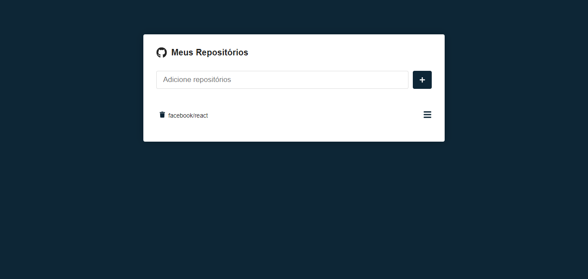

# List Repositories

Aplicação para listar repositórios do Github, consumindo sua API.
 
[Deploy](https://list-repositories.netlify.app)

 
 

## Tecnologias

- React
- TypeScript
- Styled Components
- Axios
- Vite

---

## Página Principal

## Detalhe do Repositório

